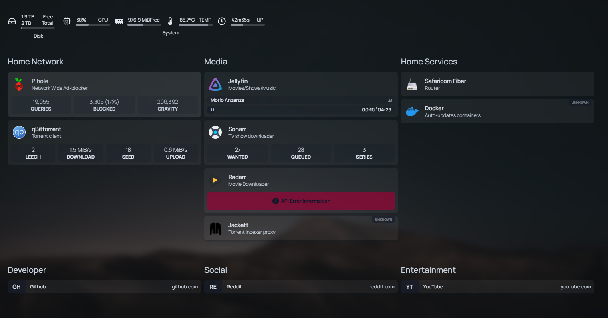

# Raspberry Pi Media Server

A simple, lightweight, and ARM-friendly Docker-based media server stack built for Raspberry Pi.
## 🧰 Features

- **qBittorrent** – Torrent downloader with a sleek web interface
- **Sonarr** – TV series management and automatic downloading
- **Radarr** – Movie management and automation
- **Jellyfin / Plex** – Stream media across your devices
- **Homepage Dashboard** – Custom dashboard for managing services
- **Tailscale / Headscale** – Secure remote access

## 📷 Screenshot

 

## 🧰 Included Services

| Service     | Purpose                        | Port |
|-------------|--------------------------------|------|
| Homepage    | Dashboard UI                   | 3000 |
| qBittorrent | Torrent Client + VueTorrent UI | 8080 |
| Sonarr      | TV Show Management             | 8989 |
| Radarr      | Movie Management               | 7878 |
| Jackett     | Indexer Proxy for Torrent Sites| 9117 |
| Pi-hole     | Network-wide Ad Blocking       | 80/53/443 |

## 📦 Hardware Requirements

- Raspberry Pi 4 (2GB/4GB/8GB)
- microSD card (16GB minimum, 32GB+ recommended)
- External HDD or SSD (for media storage)
- Active cooling (optional but recommended)

## ⚙️ Software Stack

- Docker
- Docker Compose
- Portainer (optional)
- Pi OS Lite (recommended)

## 🚀 Setup Instructions

### 1. Flash OS and Prepare Raspberry Pi

```bash
# Update system
sudo apt update && sudo apt upgrade -y

# Install Docker & Docker Compose
curl -sSL https://get.docker.com | sh
sudo usermod -aG docker $USER

# (Optional) Reboot the Pi
sudo reboot

## 🚀 Getting Started

1. **Clone the repo**
   ```bash
   git clone https://github.com/stickmanKE/raspberry-pi-media-server.git
   cd raspberry-pi-media-server

sudo apt update
sudo apt install docker.io docker-compose -y
docker-compose up -d

docker yaml file
version: "3.8"

services:
  homepage:
    image: ghcr.io/gethomepage/homepage:latest
    container_name: homepage
    ports:
      - 3000:3000
    volumes:
      - ./homepage:/app/config
      - /mnt/hdd1:/mnt/hdd1:ro
    restart: unless-stopped

  qbittorrent:
    image: lscr.io/linuxserver/qbittorrent:latest
    container_name: qbittorrent
    environment:
      - PUID=1000
      - PGID=1000
      - TZ=Africa/Nairobi
      - WEBUI_PORT=8080
    volumes:
      - ./qbittorrent/config:/config
      - /mnt/hdd1/torrents:/downloads
    ports:
      - 8080:8080
      - 6881:6881
      - 6881:6881/udp
    restart: unless-stopped

  jackett:
    image: lscr.io/linuxserver/jackett:latest
    container_name: jackett
    environment:
      - PUID=1000
      - PGID=1000
      - TZ=Africa/Nairobi
    volumes:
      - ./jackett:/config
      - /mnt/hdd1/torrents:/downloads
    ports:
      - 9117:9117
    restart: unless-stopped

  sonarr:
    image: lscr.io/linuxserver/sonarr:latest
    container_name: sonarr
    environment:
      - PUID=1000
      - PGID=1000
      - TZ=Africa/Nairobi
    volumes:
      - ./sonarr:/config
      - /mnt/hdd1/tv:/tv
      - /mnt/hdd1/torrents:/downloads
    ports:
      - 8989:8989
    restart: unless-stopped

  radarr:
    image: lscr.io/linuxserver/radarr:latest
    container_name: radarr
    environment:
      - PUID=1000
      - PGID=1000
      - TZ=Africa/Nairobi
    volumes:
      - ./radarr:/config
      - /mnt/hdd1/movies:/movies
      - /mnt/hdd1/torrents:/downloads
    ports:
      - 7878:7878
    restart: unless-stopped

  vuetorrent:
    image: binhex/arch-vuetorrent
    container_name: vuetorrent
    environment:
      - PUID=1000
      - PGID=1000
      - UMASK=002
      - TZ=Africa/Nairobi
    volumes:
      - ./VueTorrent:/config
      - /mnt/hdd1/torrents:/downloads
    ports:
      - 8090:8080
    restart: unless-stopped

  pihole:
    container_name: pihole
    image: pihole/pihole:latest
    environment:
      TZ: 'Africa/Nairobi'
      WEBPASSWORD: 'changeme'  # CHANGE THIS!
    volumes:
      - ./Pi-hole/etc-pihole:/etc/pihole
      - ./Pi-hole/etc-dnsmasq.d:/etc/dnsmasq.d
    ports:
      - "53:53/tcp"
      - "53:53/udp"
      - "80:80"
      - "443:443"
    cap_add:
      - NET_ADMIN
    restart: unless-stopped


